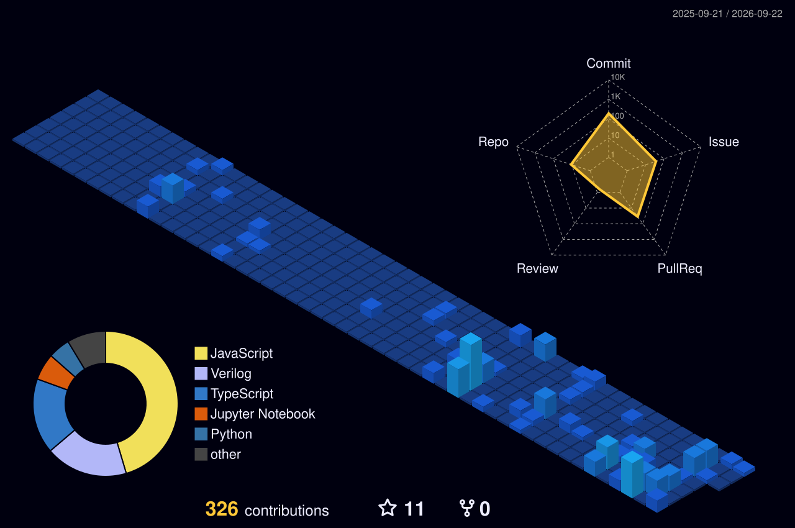

<!-- TOP BANNER & WALKING CAT ANIMATION -->

  <!-- Walking White Cat -->
  

  <!-- Cosmic Space & Cyber Dragon Banner (Deep Space Purple -> Pink -> Neon Blue) -->
  

  <!-- Dynamic Typing SVG -->
  

   

  <!-- Cosmic & Hacker Badges -->
  

    
    
    
  

---

### 💻 Tech Arsenal & Tooling

#### Programming Languages

 

#### Web, Backend & Databases

 

#### Cybersecurity, Infrastructure & Systems

 

  
  
  

#### AI & Quantum Computing

 

  
  
  

---

### 🌐 3D Hacker Telemetry & Contribution

  <!-- ดึงภาพ 3D Night View ที่สร้างจาก Action hacker-telemetry.yml อัตโนมัติ -->
  

---

### 📊 System Telemetry & Statistics

  <!-- GitHub Stats Card & Streak Card โทนสี Cosmic Synthwave -->
  
  

 

  <!-- Top Languages Compact Card -->
  

---

<!-- FOOTER -->

  

